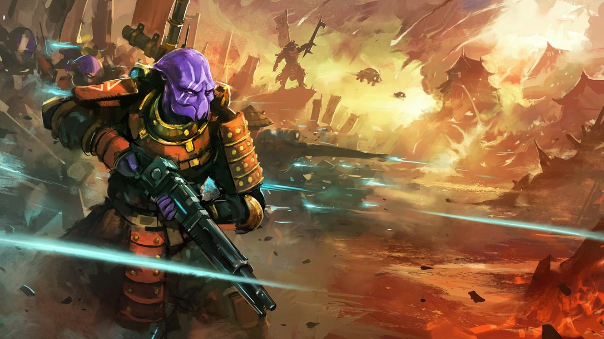

# OPR APP MOBILE FIRST

This app was made with the purpose of using a basic algorithm when a player plays in solo mode against the IA.

## Used technologies

In order to build up this app. I've used:

-   Vite
-   React
-   Three.js
-   React Three Fiber
-   React Three Drei
-   Tailwind

## Use cases

In this App, you can:

-   Use the algorithm to play this solo mode against IA
-   Visit the "About OPR" page
-   Visit the "About this App" page
-   Visit the "About me" page

## Link to page

Here is the direct link to the app:

For better enjoyment of the app, use mobile first frame or throughout a Mobil device:

-   <a href="https://oprimaellike.netlify.app/" target="_blank">https://oprimaellike.netlify.app/</a>
